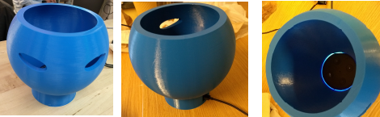

# Final Project - Physical Computing and the Internet of Things

*Name:*  Tracy Lu

*Date:* December 2017

## Project:  Security Thief
The purpose of my project was to display potential attacker effects and inspire caution about the use of IOT and cloud-based voice assistant devices, especially ones linked to private information and important smart home hardware. This was done by creating a series of Alexa Skills that involve private data and hardware. 

### Detailed Project Description

#### Background Information:
 The voice assistant device I used was the Echo Dot. Alexa is the cloud voice service and Echo is the hardware device consisting of a microphone array capable of beaming and noise cancellation which respond to the wake word “Alexa”. As an Amazon user, I thought it was interesting how much is accessible through Alexa and the Amazon ecosystem. For example, to make the Alexa Skills, I used my AWS account which is linked to my Alexa Skills Developer account, Amazon Alexa account, Amazon.com account, Zappos account, and Goodreads account, which means if someone hacked into my account through my Echo they would have access to my credit card, buying items, the things that I’m hosting on AWS, the hardware and appliances that the voice assistant is connected to, and other private information. Also, most people have their voice assistants in an open mode, meaning that anyone can talk to it and the Echo will respond. In addition, I read an [article](https://finance.yahoo.com/news/simple-hack-over-amazon-echo-125838262.html) about how some hackers are using high frequency recordings that the Echo’s hardware can pick up and execute, but that humans can’t hear, allowing them to secretly gain access to information without the owner knowing. Voice Assistants are becoming increasingly popular, especially in homes and other hardware devices. People are trusting voice assistants for lights, cameras, locks, etc. and personal information due to the convenience and services that it offers.

I wanted to demonstrate these themes with three Alexa Skills representing three different scenarios or stories.

* ##### Alexa Skill One: Phone trigger
An attacker could secretly ask the Echo to call the owner and send an evil message. The Echo does not record the voice or recording of the attacker, because the Alexa voice service only keeps the JSON objects processed from the voice commands. This allows the attacker to have anonymity and makes it difficult to track or trace back the attacker. I set up an Alexa Skill to demonstrate this, which assumes that the owner has settings on his or her device that knows the owner's phone number and allows it to be messaged, which people usually enable for convenience purposes. The attacker will ask "Alexa trigger call my phone" and the phone message sent is "Send $2000 to xyzhacker paypal account otherwise you will die tomorrow". 

* ##### Alexa Skill Two: Car Hacker
Here is a [video](https://drive.google.com/file/d/17v_A_foWOlvpR0w_vulE1JuxNCLYIStu/view?usp=sharing) of the skill. Let's say there is someone who wants to hack your car and needs to know your car model and other private information that is difficult to find. The user trusts an Alexa Skill called security thief with information about his car to get suggestions from Alexa. An attacker then exploits this information that the skill has obtained, without the owner realizing.

* ##### Alexa Skill Three: LED Strip
Originally I wanted to make an Alexa controlled LED strip that would be hooked up to my raspberry pi with mosfets controlling each of the three colors. But the last step involved changing the routing to enable port forwarding to the pi from the lambda function and alexa cloud service, but Duke OIT had a firewall that prevented this. However, in a normal home this should be fine, which simultaneously shows that home networks are not as protected as university or corporate networks, making smart home hardware even more vulnerable. I am planning to set this up at home over winter break.

### Technical Description

* ##### Alexa Skill One: Phone trigger
This was made by linking my Amazon Alexa account to an IFTTT applet and adjusting the settings in the IFTTT applet. The hardware in this skill was my Echo Dot and my phone. 

 

* ##### Alexa Skill Two: Car Hacker
The hardware involved in this skill is my Echo Dot and a hypothetical car. The software tools and services used were the Alexa Developer Platform and a Python AWS Lambda Function, which integrates with the Alexa API very nicely. Below are screen shots of the Alexa Developer Platform interaction model and Lambda Function Set up. The interaction model is generated from the Alexa Developer Platform settings and the Natural Language Processing provided by the Alexa Service. Having different Sample Utterances for each intent "trains" the model and allows the user to speak a command in different but equivalent ways, in addition to generated commands that Alexa knows is equivalent. The code for the settings can be found [here](code/AlexaInteractionModel)

Linking the arn ID of the AWS Lambda Function

 

Setting up the data used to train and generate the interaction model

 

Online simulation and testing

 

Setting up the triggers and linking other services

  

##### Code
Lambda Function Python code can be found [here](code/lambdaFunctionSkill2.py). The code basically handles the intents sent from the interaction model and user's voice inputs, and details what kind of responses should be given. 

* ##### Alexa Skill Three: LED Strip
The hardware used in this skill were RGB LED strip, raspberry pi, breadboard, mosfets, wires, power jack adpaters, power source, and Echo Dot. 

This is a diagram representing how the main hardware components were wired together. 

### Design / Form
The 3D printed enclosure represents a thief. I modeled the enclosure specific to the dimensions of the Echo Dot and left the top hollow for acoustic effects. I also made sure there was enough of a gap between the edge of the enclosure and the outer array of microphones. 

The [video](https://drive.google.com/file/d/17v_A_foWOlvpR0w_vulE1JuxNCLYIStu/view?usp=sharing) also shows a 360 view of the enclosure. 

### Evaluation / Reflection
My personal evaluation of the project was that it was fun, unique, and insightful. I got to get my hands on a little bit of everything from 3D printing and wiring to coding and storytelling which I really enjoyed. 

I was not expecting to have issues with connecting my pi to the Alexa cloud service, and was surprised by the firewall and restrictions implemented by Duke OIT. This did make me more aware of the security and "behind the scenes" of Duke networks, and how different it is from a home network, which actually helped me prove my of my point regarding the vulnerability of smart home devices. Although my LED strip couldn't be connected on Duke's WiFi, I plan to bring back the set up over winter break and try it in my home. 

Also, this was my first experience learning about the raspberry pi, which I thought was cool because I have always been curious about it.

In the future I would try integrating my Alexa Skill with other API's outside of Amazon just to expand its capacity and see how it works. 
